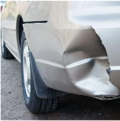

<h1 align="center">Impact of transfer learning techniques in identifying the type of damage on an image for car insurance claims.</h1>

  <a href="#about">About</a> •
  <a href="#data-sources">Data sources</a> •
  <a href="#sample-images">Sample images</a> •
  <a href="#image-distribution">Image Distribution</a> •
  <a href="#training">Training</a> •
  <a href="#results">Results</a> •
  <a href="#work-in-progress">Work in progress</a> •  

## About

The main objective of the project is to find the best candidate model to automate the classification of the location of damage on the car in a supplied image. To achieve this, 3 transfer learning techniques are considered were pre-trained models are used as (1) feature extractors, (2) for weight initialization and model fine-tuning then carried out and lastly (3) combination of feature extractor and weight initialization. As part of applying transfer learning to the task, comparison of different optimizers and learning rates is carried out to identify sensitivities of the above techniques.The results identify transfer leaning techniques (2) and (3) to be more sensitive to optimizer and learning rate. The best candidate model for the task selected based on accuracy and F1-score, is a wide residual network.

The full paper and poster are included in this repository.

## Data sources

Original dataset with car damage images has 1500 images. This is distributed over 11 classes. To prevent the models from learning to identify the part of the car in the image instead of if damage exists or not, supplementary images are included from the Cars dataset. The relevant credits for the images can be found in the paper for this project.

## Sample images

The sample images below show a bumper dent, door dent, headlamp damage, multi-area damage and no damage respectively.

## Image Distribution

The following plots show the distribution of the images in the training and test sets.

## Training

The training of the models was done on Google colab, hence the training pipeline has been optimized for that. To train on Google colab, you can use the training pipeline notebook. The plotting notebook can be used to run test set statistics on a chosen model.

## Results

Highlights of some of the model comparison results are shown below.

The chosen model performance on test set is shown in the confusion matrix below.

## Work in progress

To do:

- Improve feature detection
- Introduce sample imbalance correction techniques
- Implement object detection in the images instead of classifying the images.
